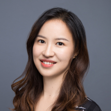

---
#
# By default, content added below the "---" mark will appear in the home page
# between the top bar and the list of recent posts.
# To change the home page layout, edit the _layouts/home.html file.
# See: https://jekyllrb.com/docs/themes/#overriding-theme-defaults
#
layout: default
title: About
---

## About Me 关于我 Check out my new site: [yitinghan.com](https://yitinghan.com/)

I am currently a lecturer and teacher educator at [Singapore Centre for Chinese Language, Nanyang Technological University](https://www.sccl.sg/en/about/organizational-structure/staff/65-lecturer/1575-dr-han-yiting.html).

I received my Ph.D. from the interdisciplinary program of [Second Language Acquisition and Teaching](https://slat.arizona.edu/) at the University of Arizona, with a focus on Learning Technologies and Digital Literacies. Coming from an interdisciplinary learning background myself (language, culture, literacy, education, human-computer interaction, speech technology, educational technology, you name it), I am interested in how an innovative combination of technology and humanity can spark creativity that might inform or even transform the future landscape of education. More specifically, I have researched on technology-enhanced language learning and teaching, autonomous/self-regulated learning, life-long learning, gameful learning, multimodal literacies, and learners’ identities, motivation, and agency. I am also interested in interdisciplinary learning that blends science and humanities for future-ready learners. As an educator who has taught Chinese, English, and Spanish language in both K-12 and university settings, I am committed to promoting multilingual/multicultural inclusion in education. I believe that learning is a dynamic and emergent journey of becoming and I am passionate about supporting and fostering life-long learners and educators.

My personal interests, outside of languages and education, include hiking (I enjoy hiking in the desert actually) and road tripping, casual reading and writing (I tried to write Wuxia stroies, one of my fav genres), meditation, traveling, and kickboxing.

## Contact Me 联系我
The best way to reach me is through email: [yiting.han@sccl.sg](mailto:yiting.han@sccl.sg). You can also find me on [Academia.edu](https://nanyang.academia.edu/YitingHan), [Researchgate](https://www.researchgate.net/profile/Yiting-Han) and [Google Scholar](https://scholar.google.com/citations?user=33RFwjsAAAAJ&hl=en).
